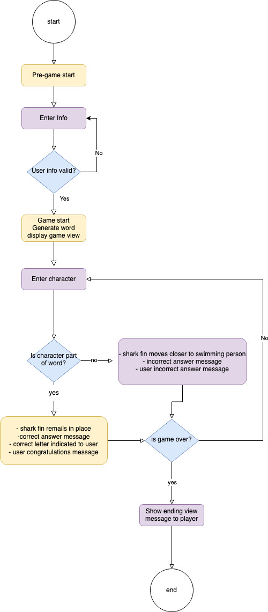

# **Shark Fin**

Shark Fin is a word challenge game. A simple game that is played in the command line. 

This game is a modern take on the traditional 'Hangman' version. 

The aim of the game is to guess a random word by entering one letter at a time. You have a limited number of attempts. If you manage to guess the correct word before you run out of attempts, you win, otherwise the shrk catches you and you lose.

The game concept is simple, but it is a challenging game. It's a great way to sit back, relax and challenge yourself. Enjoy!

[image - responsiveness]

---

## Contents:
- User Experience:
- User Requirements
- 

----

## User Experience:
### User requirements:

#### As a user I expect:

- to understand how the game works quickly.
- feedback while playing the game.
- to be able to restart the game easily.
- text that is easy to read.
- color that helps me understand the feedback.
- to be able to access the game rules easily.

### How Shark Fin works:
- The program chooses one word randomly from the list with 500 different words.
- The word is presented as dashes, one for each letter in the word.
- It is only allowed to guess one letter at a time. The Shark Fin dosn't move forward if it's a correct guess.
- When the players guess is wrong, the game will notify the player and the Shark Fin graphic will change to be one step closer to the swimming person. 
- The player wins when the word is guessed and all lives are not lost. A message will display.
- The player loses if the lives runs out. A message will show to tell the game is over.
- When the game is finished the player can choose to restart, or otherwise return to the starting screen.

### Wireframes/ Flowchart:
As this game only is played in the terminal, no wireframes for the visual was done before the project started. I did a simple flowchart to guide me through the coding and to get a map for how I wanted it to work.

### Design:
The design is very limited in this because it's played through the terminal. I have put some color and ASCII-art in it to make it look more appealing. This also helps with the feedback as the text is in different color for when you guess right or wrong for example.

## Features:
### Existing Features:

#### Start: 
When you start the game you will be able to enter your name. This is for personal feedback through the game.

 [image]

 #### Menu: 
 In the next step you have two choices. Start the game or read the rules.

 [image]

 #### Rules:
 A short explanation of the rules and stes of the game with the possibility to return to the main menu by hitting enter.

 [image]

 #### Playing the game:
 - When playing the game you receive feedback in green when the guess is correct. Along with the letter in the correct position.

- If you guess wrong, it will notify you in red text along with a graphic ofthe shark fin moving closer to the swimming person.

[image]

#### Guessing the same letter:

- If you guess same letter more than once you will be notified in yellow text. No lives is withdrawn and you can try again.

[image]

#### End of game:

- When game is finished you will be greeted with different graphics and colors depending on if you win or loose.
- You can choose if you want to play again or return to main screen.

#### Future Features:
- Add levels of difficulty.
- Add a multiplayer option.
- Add more graphics and possibly a background image instead of a plain background.

-----

## Technologies Used:
### Main Language:
- Python

### Other Frameworks, Libraries and Software Used:
Python Standard Library (OS and Random)
OS is used for the colors.
Random is used for getting a random word from word.txt.
Figma was used for the flowchart scetch.
Heroku was used to deploy the live version.
GitHub was used for storing my repository.
Gitpod was used to create all files with code.
Files containing HTML, CSS and JavaScript were all provided by Code Institute for this project.
??????????

-----

## Testing:
### Manual Testing:
This project has been tested manually for the most part. Mostly by myself playing it over and over again to make sure the logic worked. Manual testing was also done for making sure I got necessary feedback while playing, and that the feedback was presented in a clear way.

I also asked two friends to test the game to get an outside opinion on the functionality and the flo of the game.

### Input Validation:
- When entering your name in the start it validates that it is only letters entered.

[image]

- When choosing 1 or 2 in the meny it validates that, if you put something else in it will tell you that you need to choose 1 or 2.

[image]

- When guessing letters it validates that the input is one letter and nothing else.

[image]

- If you guess same letter twice you will be notified and will be able to try again.

[image]

### Validator Testing:
The code has been tested with PEP8 online. At first there were some warnings about trailing whitespaces and too long lines. But now it passes without any warnings or errors.

[link]
[image]

- Lighthouse testing essential???

------

## Bugs:
### Solved:

### Left to solve:

----

## Deployment:
- This application is deployed using Heroku. [link]

----
## Credits:
